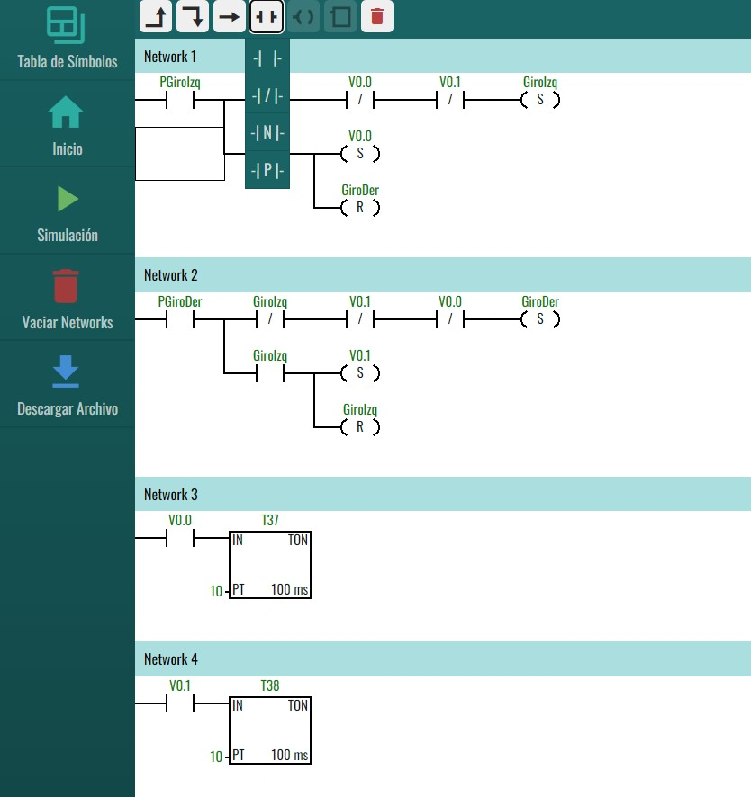
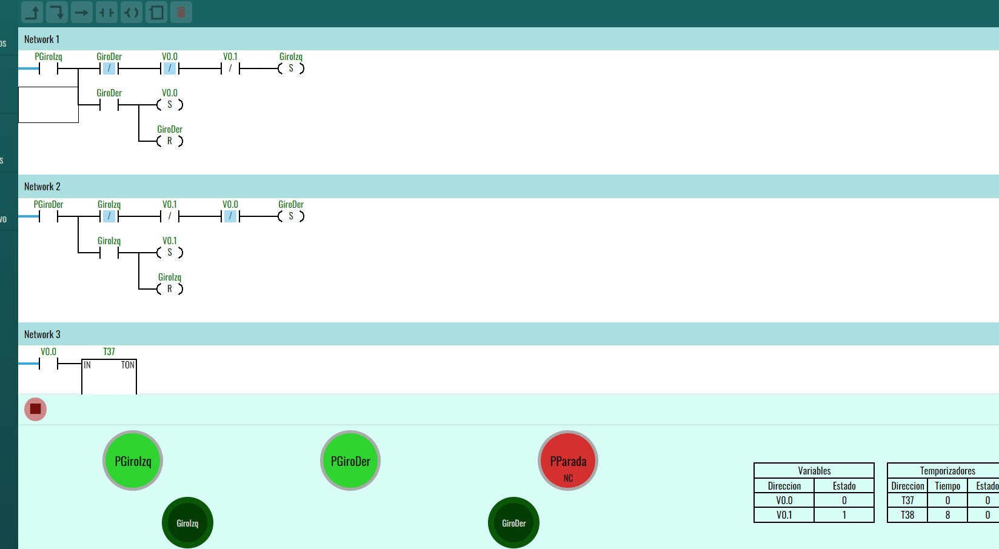
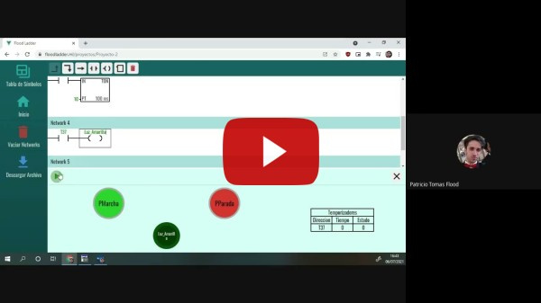

# Flood Ladder

PWA: [https://ladder.flood.ar](https://ladder.flood.ar)

## Description

Ladder programming and PLC simulation project, similar to MicroWin STEP7 of the Siemens S7-200 PLC branch, for students of Technical School "Ing. Otto Krause"

## Guía Rápida

1. Crear un nuevo proyecto y completar la tabla de símbolos. 

2. Realizar la programación con los símbolos escritos anteriormente.

3. Realizar la simulación y ver que el programa funcione adecuadamente.

4. Es posible descargar el archivo para poder pasarlo al PLC o guardarlo como borrador (esto se hace de forma automatica y posteriormente se lo puede renombrar)

Esto es solo un resumen, la aplicación tiene muchisimas funcionalidades útiles para el desarrollo de una simulación adecuada.
Ya que está desarrollada para el uso en clases de Automatismo de la Escuela Técnica Nº1 Otto Krause, dejo un video de una clase regrabada donde explico el funcionamiento detallado de la misma.

  <a href="https://youtu.be/KtWgIWTRIoM" title="Clase de Automatismo - FloodLadder"></img></a>

